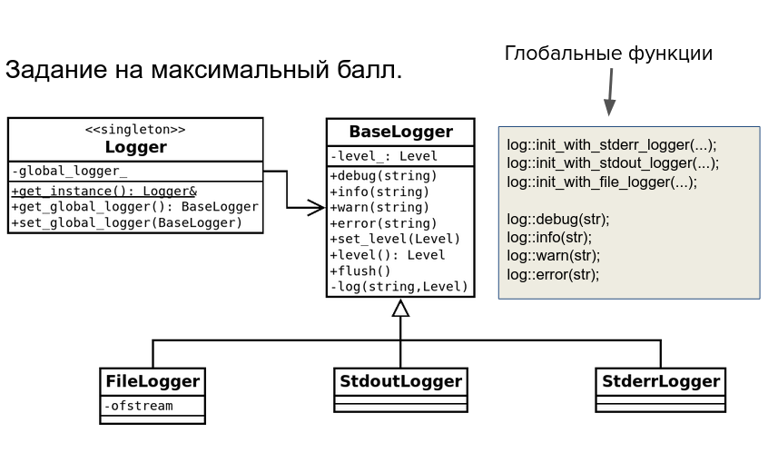

# Логгер
## Задание
Создать библиотеку с именем и пространством имен log.
Функционал библиотеки должен позволять записывать лог программы в стандартные потоки вывода/ошибок и в файл.
Лог должен обладать 4 уровнями с именами: debug, info, warning, error.
При выводе сообщения указывается его уровень. Лог выводит только те сообщения, которые выше (приоритетнее) его уровня.



## Сборка
```
mkdir build
cd build
cmake ..
make
```

## Тестирование
Для запуска необходимы параметры:
+ `--global` используется в сочетании с другими параметрами для тестирования глобального логгера (этот аргумент может отсутствовать)

+ Один из следующих параметров:
  + `--file` для тестирования FileLogger (следующим параметром обязательно указывается путь к файлу)
  + `--stdout` для тестирования StdoutLogger
  + `--stderr` для тестирования StderrLogger

+ Далее уровень логгера:
  + `0` - DEBUG
  + `1` - INFO
  + `2` - WARNING
  + `3` - ERROR

По умолчанию глобальный логгер инициализируется как StderrLogger
