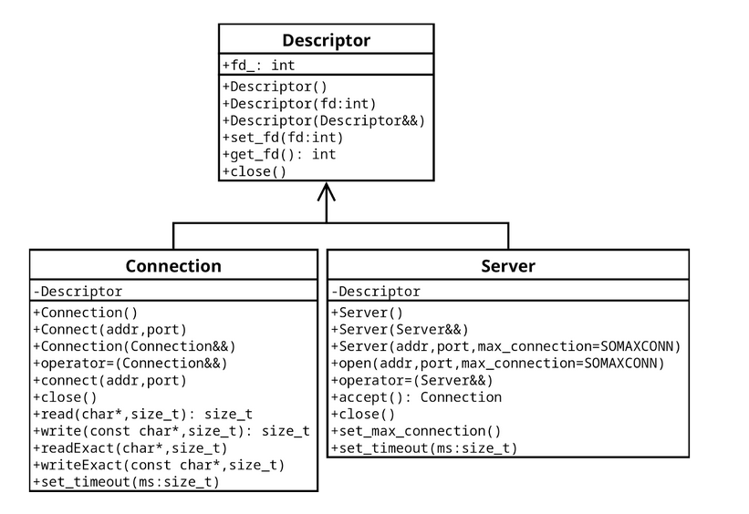

# TCP Сервер/Клиент
## Задание
Создать библиотеку с именем tcp.
Функционал библиотеки должен позволять создавать и принимать соединения по протоколу tcp/ipv4.
Подключение, чтение и запись должны обладать опциональным параметром таймаута.

Библиотека должна гарантировать базовую безопасность исключений и соответствовать диаграмме классов



## Сборка
```
mkdir build
cd build
cmake ..
make
```
Исполняемый файл будет называться task3

## Тестирование
Для запуска необходимы параметры:
+ режим работы: `--server` или `--client`
+ `IP_address`
+ `mode` - число, определющее режим проверки функий получившегося соединения: 0-read, 1-readExact, 2-write, 3-writeExact
