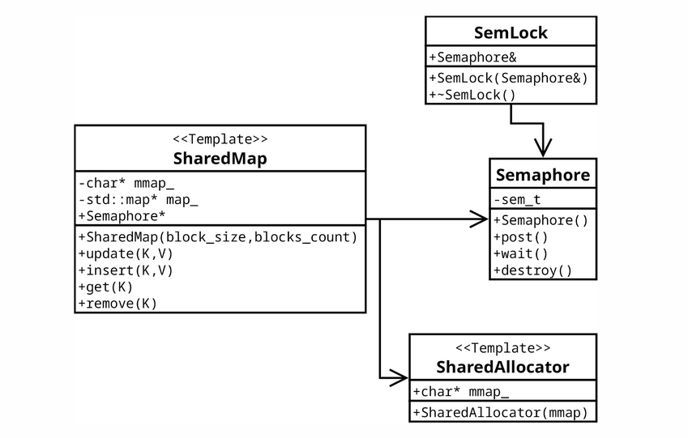

# Shared Map
## Задание
Создать библиотеку с именем shmem.
В библиотеке должен быть реализован класс словаря Map, состояние которого разделяется между форками.
Словарь должен поддерживать POD типы и std::string в качестве ключа и значения.
Словарь должен быть реализован на std::map с собственным аллокатором памяти.
Должны быть реализованы методы вставки, удаления, изменения и получения элемента.
Библиотека должна гарантировать базовую безопасность исключений.



## Сборка
```
mkdir build
cd build
cmake ..
make
```
Исполняемый файл будет называться task4

## Тестирование
При запуске исполняемого файла запускаются тесты