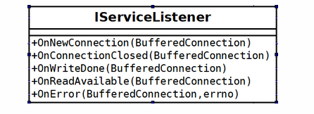
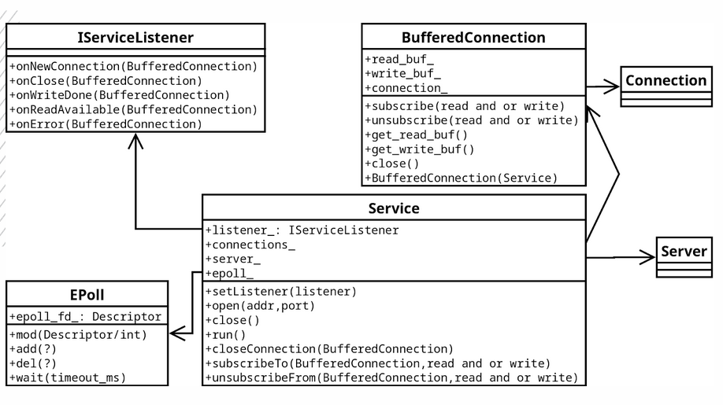

# Epoll Service
## Задание
Создать библиотеку с именем net.
В библиотеке должен быть реализован класс сервиса Service, который позволяет управлять соединениями через callback интерфейс:\


Библиотека должна гарантировать базовую безопасность исключений и соответствовать диаграмме классов:



## Сборка
```
mkdir build
cd build
cmake ..
make
```
Исполняемый файл будет называться task5